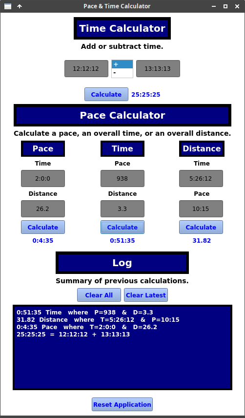

# Pace & Time Calculator
This is a small calculator that can add or subtract time as well as calculate a pace time, overall time, and distance covered.<br><br><br>



## Installation
#### With docker:
1. ```chmod u+x ./build.sh ./run.sh```
2. ```./build.sh```
3. ```./run.sh```

#### Without docker:
Requires Python version >=3.6 and PyQt5.<br>
1. Copy contents of app folder.
2. Run mainwindow.py<br><br>


## Instructions
Entry fields for distance allow usage of one decimal.<br>
For time, use one of the following formats where H=hours, M=minutes, and S=seconds.<br>
Any time entry not containing a colon will be read as seconds.

* HH:MM:SS, MM:SS, or SS<br><br>


## Time Calculator
Perform addition or subtraction on two timestamps.<br><br>


## Pace Calculator
### Pace
Calculate a pace time using an overall time and the distance covered.<br>
Input a timestamp in the top field and a distance in the bottom field.<br>

### Time
Calculate an overall time using a pace time and the distance covered.<br>
Input a pace time in the top field and the distance covered in the bottom field.<br>

### Distance
Calculate the distance covered using a pace time and an overall time.<br>
Input the overall time in the top field and the pace time in the bottom field.<br><br>


## To Do

* Add division and multiplication for time calculations<br>
* Add themes and settings
